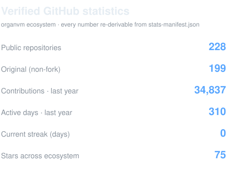
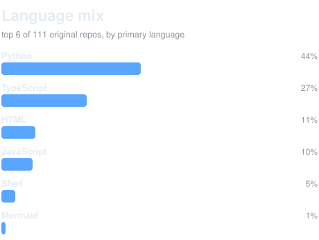
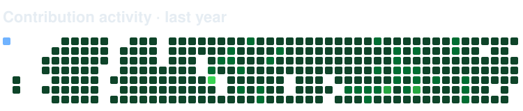

<!-- Generated by 4444J99/limen · scripts/sync-readme.py — DO NOT EDIT BY HAND. -->
<!-- Every number is re-derivable from ./assets/stats-manifest.json. -->

# Anthony James Padavano &nbsp;·&nbsp; `@4444J99`

**I build production systems that solve expensive problems.** Selected systems range from live infrastructure to deployed tools and working prototypes. Every card states its current maturity and evidence basis.

The work ships under the [**organvm** ecosystem](https://github.com/organvm) I architect — **226 public repositories** (197 original), **33,490 contributions** in the last year. On GitHub since 2016.

Architected and directed by one person through a governed, multi-agent production system.

&nbsp;&nbsp;

## The library — one system, eight shelves

One creator, one library. The engine room (organvm) holds the machine that builds everything; each shelf org holds one kind of finished work.

| Shelf | What lives there |
|---|---|
| [**I · THEORIA**](https://github.com/organvm-i-theoria) | Epistemological frameworks and recursive systems |
| [**II · POIESIS**](https://github.com/organvm-ii-poiesis) | Generative art and interactive systems |
| [**III · ERGON**](https://github.com/organvm-iii-ergon) | Autonomous product systems — the product ledger |
| [**IV · TAXIS**](https://github.com/organvm-iv-taxis) | Orchestration: governance, registry, automation |
| [**V · LOGOS**](https://github.com/organvm-v-logos) | Public process: essays, methodology, thought leadership |
| [**VI · KOINONIA**](https://github.com/organvm-vi-koinonia) | Community infrastructure and facilitation |
| [**VII · KERYGMA**](https://github.com/organvm-vii-kerygma) | Content distribution and audience amplification |
| [**META**](https://github.com/meta-organvm) | Eight organs, one system — the map |
| [**ENGINE ROOM**](https://github.com/organvm) | The working mass: the machine, its governance, and everything not yet shelved |

_Shelves are populating — the estate migration is registry-driven from 4444J99/limen._

## The systems

Each entry states its current maturity and shows only evidence verified for this Level-1 surface. Repository-reported metrics remain on the linked Level-2 pages with their labels.

### [Self-Healing Agent Fleet Infrastructure](https://github.com/4444J99/limen)
A live orchestration and governance system operating in its owner's environment since May 2026, with explicit failure states and human gates.

**Current state:** Live in the owner's environment; external adoption unvalidated; human gates remain explicit.

`verified: heartbeat-driven autonomic loop (scripts/metabolize.sh)` · `verified: proprioception, VIGILIA federation, branch-reap, and credential-wall organs are present` · `verified: failure states and human gates are explicit`

→ [Inspect the documented current state](https://github.com/4444J99/limen/blob/main/docs/positioning/limen.md)

### [a-i--skills](https://github.com/organvm-iv-taxis/a-i--skills)
**Current state:** Deployed public library; external adoption is modest and directly observable.

`verified: 15 stars and 7 forks, with external accounts verified on 2026-08-09`

→ [Inspect the documented current state](https://github.com/organvm-iv-taxis/a-i--skills)

### [MONETA](https://mint.4444j99.dev)
**Current state:** Live; revenue and external adoption are unverified.

`verified: public mint endpoint returned HTTP 200 on 2026-08-09`

→ [Inspect the documented current state](https://github.com/4444J99/limen/blob/main/docs/positioning/claims-ledger.md#2-product-claims)

## Adapted from the builders I follow

I harvested the profile READMEs of **all 61 accounts I follow** and rebuilt their best techniques as my own self-hosted, no-third-party-widget versions. The most-adopted signals across my follows:

- **Shields.io badge row** — 8 of my follows use it (@prometheus, @gollum, @asciinema) → my own self-hosted [`badges.svg`](./assets/badges.svg).
- **Language breakdown card** — 2 of my follows use it (@TimothyZhang7, @JawherKl) → my own self-hosted [`languages.svg`](./assets/languages.svg).
- **GitHub stats card** — 2 of my follows use it (@madhanio, @JawherKl) → my own self-hosted [`stats-card.svg`](./assets/stats-card.svg).
- **Contribution streak** — 2 of my follows use it (@TimothyZhang7, @JawherKl) → my own self-hosted [`streak.svg`](./assets/streak.svg).
- **Activity line graph** — 1 of my follows uses it (@JawherKl) → my own self-hosted [`heatmap.svg`](./assets/heatmap.svg).
- **Contribution snake animation** — 1 of my follows uses it (@mennylevinski) → my own self-hosted [`snake.svg`](./assets/snake.svg).

_Full ranking: [`assets/follow-harvest-report.md`](./assets/follow-harvest-report.md) · regenerated weekly._

## Two doors

**[Have a problem one of these solves? — Deploy it for your shop](mailto:contact@4444j99.dev?subject=%5Bfront%20door%20%C2%B7%20deploy%5D%20%E2%80%94%20inbound)**  
> Pick the depth that fits. We feed you the output, run it under your brand, build it for your exact world, or become your engine.

**[Hiring someone who ships at this level? — Work with the builder](mailto:contact@4444j99.dev?subject=%5Bfront%20door%20%C2%B7%20hire%5D%20%E2%80%94%20inbound)**  
> Everything here is the portfolio. If you need a senior builder who owns systems end-to-end — data, infra, AI, deploy — this is the evidence.

_If any of this fits, reach out. This conversation starts at serious._

---
Every number on this page is regenerated from the live GitHub API and re-derivable from <a href="./assets/stats-manifest.json">stats-manifest.json</a> (api-attested = re-run the query; repo-attested = the repo's own CI). Visuals are self-hosted SVGs rendered by <a href="https://github.com/4444J99/limen">4444J99/limen</a> — no third-party widgets. Generated 2026-08-28T18:44:47Z.
